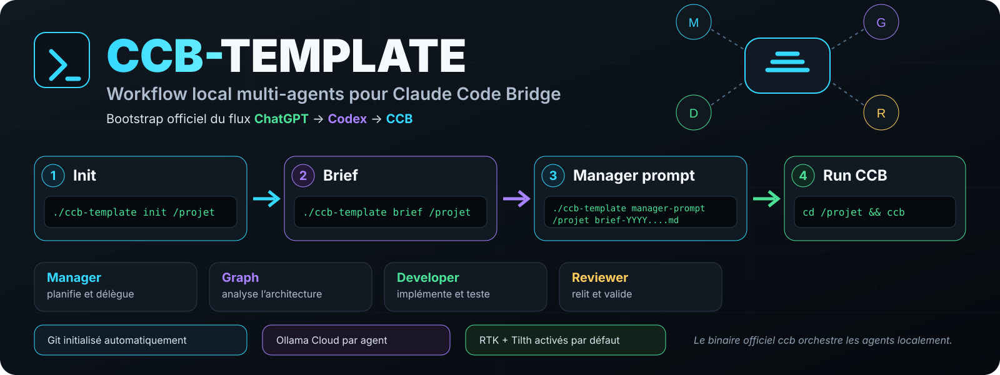
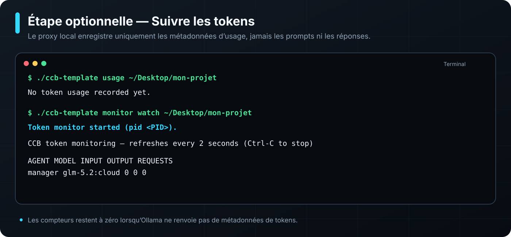
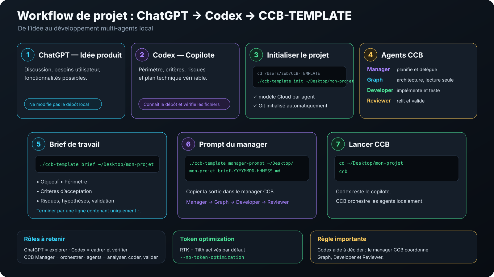
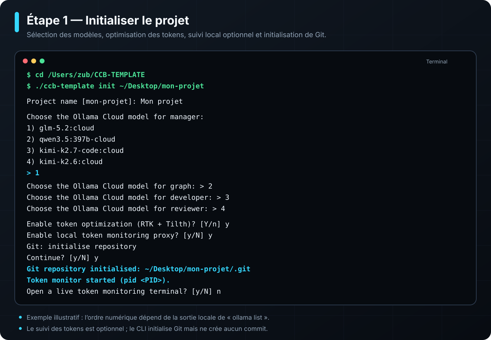
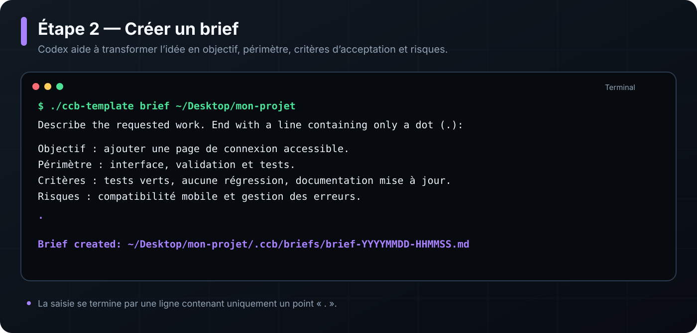
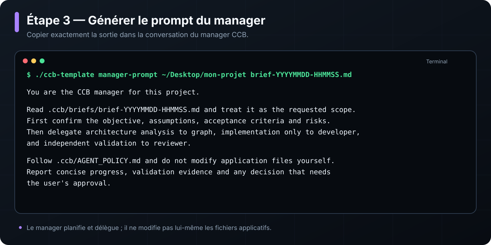
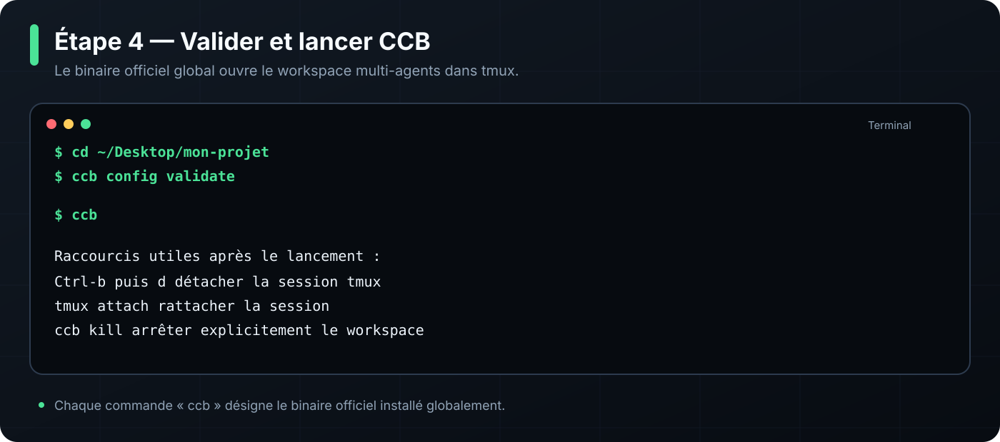

<p align="center">
  
</p>

# CCB Template

[](https://github.com/broduoliviercontact-web/CCB-TEMPLATE/actions/workflows/validate.yml)
[](LICENSE)

## CCB-TEMPLATE 2.0.0

CCB-TEMPLATE configures the official [SeemSeam/claude_codex_bridge](https://github.com/SeemSeam/claude_codex_bridge).
It is a bootstrap template: it verifies prerequisites, generates the official project configuration
and installs reusable text assets. It is not an orchestration engine and does not use OpenCode.
It requires official CCB 8.4.3 or later.

```sh
./install.sh /chemin/du/projet \
  --name "Nom du projet" \
  --profile web \
  --claude-ollama-cloud \
  --yes

cd /chemin/du/projet
ccb config validate
ccb
```

### Interactive project creation

Create a new project, choose an installed Ollama Cloud model for each permanent agent and
initialise Git in one interactive flow:

```sh
./ccb-template init /chemin/du/projet
```

The target directory must be new or empty. The CLI never creates a commit or pushes. After project
creation, it proposes an initial CCB brief and explicitly asks whether to start CCB. Create a new
dated brief later with `./ccb-template brief /chemin/du/projet`; finish the input with a line
containing only `.`.

For a Codex-driven workflow where the product brief has already been confirmed, use the automatic
mode. It selects the preferred installed Ollama Cloud models, enables token optimization and token
monitoring, initializes Git, starts only the monitoring proxy and leaves CCB itself stopped:

```sh
./ccb-template init /chemin/du/projet --auto
```

The automatic mode does not create a brief or start CCB. Codex creates the first dated brief and
the manager handoff after initialization. The target directory must still be new or empty.

### Optional token monitoring

Choose token monitoring during `ccb-template init`, pass `--token-monitoring` to `install.sh`, or
enable it later with `ccb-template monitor enable /chemin/du/projet` to route the four agents
through a local transparent proxy. It records only timestamp, agent,
model, input tokens, output tokens and duration in `.ccb/token-monitor/`; it never stores prompt
or response content. Each project automatically receives a free local port (stored in
`.ccb/token-monitor/port`), so several projects can run independently. The interactive CLI starts the proxy during configuration. View the collected
metrics with:

```sh
./ccb-template monitor /chemin/du/projet
```

For an existing CCB project, enable or disable the proxy without replacing the project
configuration:

```sh
./ccb-template monitor enable /chemin/du/projet
./ccb-template monitor disable /chemin/du/projet
```

The command preserves a direct-connection backup, changes only the four agent API URLs, starts
the proxy after validation, and restores the direct configuration if the proxy cannot start.
The monitor needs Python 3.10+ with `aiohttp` and `cryptography`. If the template cannot find
that interpreter automatically, set `CCB_PYTHON` before enabling it:

```sh
CCB_PYTHON=/path/to/venv/bin/python ./ccb-template monitor enable /chemin/du/projet
```

If Ollama does not return token counters for a response, that request remains visible but its token
columns are zero rather than estimated. The dashboard includes totals, per-agent share, recent
five-minute activity and an alert when one agent reaches 70% of input-token usage.

The interactive setup can open a separate Terminal window with live totals. Open it later with:

```sh
./ccb-template monitor watch /chemin/du/projet
```

Ollama does not expose a stable public per-model token price for this template to treat as billing
truth. You may configure your own planning rates in `.ccb/token-monitor/pricing.json`; the dashboard
labels the resulting dollar amount as an estimate only. Display the file format with:

```sh
./ccb-template monitor price /chemin/du/projet
```

`ccb-template start /chemin/du/projet` waits until this proxy is ready before launching CCB. If
`ccb kill -f` has removed monitor files under `.ccb/`, the command restores the proxy, Python
setting, port and pricing file from the durable `.ccb-template/token-monitor/` backup first.

<p align="center">
  
</p>

### Codex → CCB workflow

Use Codex as the project copilot: turn the product discussion into a concise brief, then create it
with `ccb-template brief`. Ask Codex to review the brief before execution. Generate the exact
manager handoff prompt with:

```sh
./ccb-template manager-prompt /chemin/du/projet initial-brief.md
```

Paste that output into the CCB manager conversation. The manager then delegates to graph,
developer and reviewer; Codex remains your partner for decisions and follow-up briefs.

### Codex project-starter skill

The repository includes the reusable `$start-ccb-project` Codex skill. It turns an idea discussed
with ChatGPT into a bounded first brief, asks for confirmation of the target directory, runs the
automatic CCB initializer with token optimization and monitoring, and produces the handoff prompt
for the CCB manager. Use the interactive initializer only when you explicitly want to choose the
models and options manually.

Install it in your personal Codex skills directory from a clone of this repository:

```sh
mkdir -p ~/.codex/skills
cp -R ./codex-skills/start-ccb-project ~/.codex/skills/
```

Then, in a new Codex task, use:

```text
Use $start-ccb-project to turn this idea into a new CCB project: [your idea]
```

<p align="center">
  
</p>

### CLI walkthrough

The terminal captures below illustrate the commands and prompts implemented by the current
`ccb-template` script. The list and numeric order of Ollama Cloud models depend on the local
`ollama list` output.

#### 1. Initialise the project

<p align="center">
  
</p>

#### 2. Create a dated brief

<p align="center">
  
</p>

#### 3. Generate the CCB manager handoff

<p align="center">
  
</p>

#### 4. Validate and start CCB

<p align="center">
  
</p>

Every `ccb` command in this branch denotes the official globally installed CCB binary. The
repository-local `./ccb` command has been removed, as have the V1 provider router, direct Ollama
runtime and home-grown workflows. The installer never pushes or deploys automatically, never
interprets model responses and never starts CCB or a Cloud model by itself.

`--profile web` selects the standard built-in asset preset. It is the only preset supported by
V2.0.0 and does not load a `profiles/` directory.

### Default agent guidance

Each generated project receives a common `CLAUDE.md`, a role brief and durable memory for each
CCB agent, plus project-local planning, architecture analysis, implementation and review skills.
Existing user-authored files are preserved. CCB's managed agent homes remain runtime-owned; the
role memories are the durable CCB-native instructions for the isolated agents.

### Token optimization by default

The standard installation prepares the generated project for the external RTK terminal filter and
the Tilth MCP code-navigation server. It verifies `rtk` and `npx`, writes project-local
`.mcp.json` with the pinned `npx -y tilth@0.9.0 --mcp` server, and adds a concise
`.claude/rules/token-optimization.md` without replacing an existing user rule or `CLAUDE.md`.
It never installs or initializes either tool. Use `--no-token-optimization` to skip this integration.
`--token-optimization` remains accepted for explicit configuration and backwards-compatible scripts.

```sh
brew install rtk-ai/tap/rtk
rtk init -g
npx tilth --version
```

RTK mainly filters verbose terminal output; any advertised percentage is an estimate and does
not guarantee an equivalent reduction in Claude usage. Tilth is downloaded and launched by npx
only when Claude Code starts the configured MCP server, never by this bootstrap.

The generated official configuration uses four Claude Code agents through Ollama's
Anthropic-compatible local endpoint:

| Agent | Model |
| --- | --- |
| manager | `glm-5.2:cloud` |
| graph | `qwen3.5:397b-cloud` |
| developer | `kimi-k2.7-code:cloud` |
| reviewer | `kimi-k2.6:cloud` |

See the [V2 quickstart](docs/v2-quickstart.md), [architecture](docs/v2-architecture.md),
[migration guide](docs/v2-migration-from-v1.md), [migration plan](docs/v2-migration-plan.md) and
[troubleshooting](docs/v2-troubleshooting.md).

## V1.8.0 archive

The V1 engine and all of its former commands are unavailable on `refactor/official-ccb-v2`.
They remain intact in the immutable `v1.8.0` tag for historical reference and existing V1 projects:

```sh
git show v1.8.0:README.md
```

The V1 profiles, skills, prompts and manuals were removed with the runtime; consult the tag when
maintaining an existing V1 project. V2 installs only the policy and memories under `assets/`.

## License

This template is distributed under the [MIT License](LICENSE).
