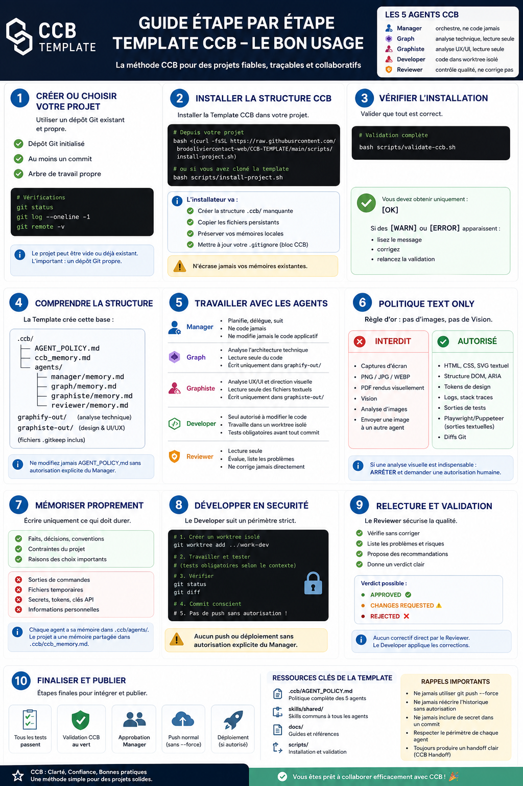

# CCB Template

[](https://github.com/broduoliviercontact-web/CCB-TEMPLATE/actions/workflows/validate.yml)
[](LICENSE)

Une base réutilisable pour orchestrer cinq agents spécialisés autour d’un projet Git : rôles
séparés, mémoires persistantes, règles de sécurité et validations reproductibles.



## Sommaire

- [Démarrage rapide](#démarrage-rapide)
- [Les cinq agents](#les-cinq-agents)
- [Utilisation recommandée](#utilisation-recommandée)
- [Skills partagés](#skills-partagés)
- [Politique TEXT ONLY](#politique-text-only)
- [Validation](#validation)
- [Arborescence](#arborescence)
- [Documentation](#documentation)

## Démarrage rapide

### Cas A — utiliser le dépôt comme template GitHub

1. Ouvrez ce dépôt sur GitHub.
2. Si GitHub affiche **Use this template** (après activation manuelle de *Template repository*),
   créez votre nouveau dépôt depuis ce modèle.
3. Clonez le nouveau projet.
4. Créez au moins un commit initial si nécessaire, puis exécutez le validateur :

   ```sh
   ./scripts/validate-ccb.sh
   ```

### Cas B — installer CCB dans un dépôt existant

Le projet cible doit être un dépôt Git avec au moins un commit ; un arbre de travail propre est
fortement recommandé.

```sh
git clone https://github.com/broduoliviercontact-web/CCB-TEMPLATE.git
cd CCB-TEMPLATE

./scripts/install-project.sh /chemin/vers/mon-projet
./scripts/validate-ccb.sh /chemin/vers/mon-projet
```

Pour mettre à jour la politique commune tout en préservant les mémoires locales :

```sh
./scripts/install-project.sh /chemin/vers/mon-projet --update
```

`--update` sauvegarde la politique précédente dans `.ccb/backups/`, met à jour la politique
commune et ne doit pas écraser les fichiers `memory.md`. Les scripts ne démarrent ni CCB ni les
agents automatiquement.

## Les cinq agents

| Agent | Responsabilité | Modification du code |
| --- | --- | --- |
| Manager | Planifie, délègue et consolide les résultats. | Non |
| Graph | Analyse l’architecture technique et les dépendances. | Non |
| Graphiste | Analyse l’UX/UI, l’accessibilité et la direction visuelle depuis des sources textuelles. | Non |
| Developer | Implémente les changements dans un worktree isolé. | Oui |
| Reviewer | Vérifie les changements et produit un verdict. | Non |

Graph concerne l’architecture technique. Graphiste concerne le design, l’UX/UI et
l’accessibilité. Le Developer reste le seul agent autorisé à modifier le code applicatif.

```text
Manager
├── Graph, si une analyse technique est nécessaire
├── Graphiste, si une analyse UX/UI est nécessaire
└── Developer
    └── Reviewer
        └── Manager
```

Graph et Graphiste peuvent intervenir séparément ou en parallèle.

## Utilisation recommandée

1. L’utilisateur donne l’objectif au Manager.
2. Le Manager clarifie le périmètre et les critères d’acceptation.
3. Graph et/ou Graphiste analysent sans modifier le code.
4. Le Developer travaille dans un worktree isolé, exécute les tests et produit un handoff.
5. Le Reviewer contrôle sans corriger directement.
6. Le Manager décide de la suite.

Aucun push ou déploiement n’est effectué sans autorisation explicite.

## Skills partagés

| Skill | Utilité |
| --- | --- |
| `ccb-handoff` | Standardise les transmissions entre agents. |
| `project-memory` | Maintient des mémoires courtes et durables. |
| `safe-git-boundaries` | Définit les limites Git et les droits des rôles. |
| `text-only-policy` | Garantit une collaboration sans Vision. |

[Consulter le catalogue des skills](skills/README.md). Les skills sont des références de
travail : ils ne donnent pas automatiquement de permissions et
[`.ccb/AGENT_POLICY.md`](.ccb/AGENT_POLICY.md) reste prioritaire.

## Politique TEXT ONLY

**Interdit :** analyse de captures d’écran, PNG/JPG/WEBP, Vision, PDF interprétés visuellement
et transmission d’images entre agents.

**Autorisé :** HTML, CSS, SVG textuel, DOM, ARIA, tokens de design, logs, tests, diffs Git et
sorties textuelles Playwright ou Puppeteer.

[Lire la politique complète](skills/shared/text-only-policy/SKILL.md). Une analyse visuelle
indispensable exige une autorisation humaine explicite.

## Validation

```sh
sh -n scripts/install-project.sh
sh -n scripts/validate-ccb.sh
sh -n tests/test-install.sh

./scripts/validate-ccb.sh
./tests/test-install.sh
```

- `[OK]` : validation réussie ;
- `[WARN]` : point à examiner ;
- `[ERROR]` : correction obligatoire.

La GitHub Action **Validate CCB Template** exécute également ces vérifications lors des pushes
et pull requests vers `main`.

## Arborescence

```text
.ccb/
├── AGENT_POLICY.md
├── ccb_memory.md
└── agents/
    ├── manager/
    ├── graph/
    ├── graphiste/
    └── reviewer/

skills/
└── shared/

graphify-out/
graphiste-out/
scripts/
tests/
docs/
```

- `graphify-out/` : sorties autorisées de l’agent Graph ;
- `graphiste-out/` : sorties autorisées de l’agent Graphiste ;
- `.ccb/` : politique et mémoires persistantes ;
- `skills/shared/` : contrats de travail communs.

## Utilisation avec Claude Code et Codex

CCB peut piloter Claude Code comme interface de fournisseur. Codex peut utiliser ce dépôt comme
contrat de workflow : il lit les politiques et mémoires, laisse le manager orchestrer et réserve
les modifications produit au developer. Aucune clé, session, état provider ou runtime CCB ne
doit être versionné.

## Documentation

- [Démarrer avec la template](docs/getting-started.md)
- [Architecture](docs/architecture.md)
- [Rôles](docs/roles.md)
- [Workflow](docs/workflow.md)
- [Politique des agents](.ccb/AGENT_POLICY.md)
- [Catalogue des skills](skills/README.md)

## Activer le dépôt comme GitHub Template

Sur GitHub, activez manuellement : **Settings → General → Template repository**.

## Licence

Ce template est distribué sous licence [MIT](LICENSE).
